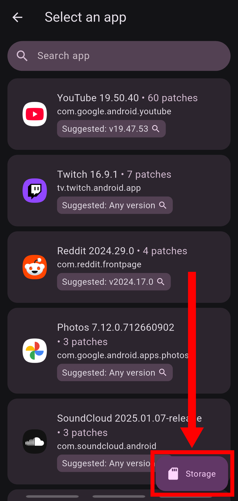

업데이트 : 250630

### **1. 필요파일 다운로드**

**1.1** ReVanced Manager ([링크](https://revanced.app/download)) -> 다운로드 + 설치

**1.2** YouTube 20.13.41 ([링크](https://www.apkmirror.com/apk/google-inc/youtube/youtube-20-13-41-release/youtube-20-13-41-2-android-apk-download/download/?key=4fd40fc7d3ab1cbf7b3ac6361d495e43cff54685&forcebaseapk=true)) -> 다운로드만, 설치 X

### **2. 패치**

**2.1** (1.1)에서 설치한 `ReVanced Manager` 열어서 필요한 권한 부여

**2.2** 하단에 `Patcher` 선택 -> 우측하단 `Storage` 누르기

**2.3** (1.2)에서 다운받은 파일 선택 (`com.google.android.youtube...`)

**2.4** `Patch` 누르기

**2.5** 완료까지 다른거 하지말고 기다리기

### **3. 설치**

**3.1** 패치 완료되면 `Install` 눌러서 설치

**3.2** 설치 완료되면 열기

**3.3** `ReVanced GmsCore` 설치하라고 하면 설치하기

### **4. 완료**

**4.1** 기존 유튜브랑 똑같이 생긴 앱 사용

---

> #### 추가정보
>
>1.2) 설치하는 유튜브 버전은 (1.1)에서 설치한 `Revanced Manager`에서 추천하는 버전을 사용, dpi는 nodpi사용
>
>2.5) 패치 완료 후 패치된 앱을 저장할 수 있음
>
>4.1) 설치 완료 후 자동 업데이트 꺼두기 추천

[Source](https://github.com/KobeW50/ReVanced-Documentation/blob/main/YT-ReVanced-Guide.md)